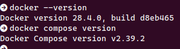
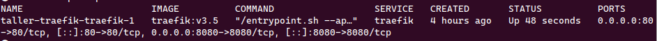
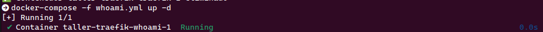
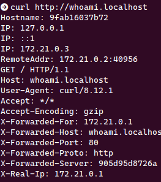

# Taller Traefik 

## Participantes

Walter Mauricio Alfonso Martinez - 202220718

Fabian Leonardo Correa Rojas - 202220087

## Preguntas

### ¿Qué ventaja aporta enrutar por host (dominio) vs por puerto?

Enrutar por host, permite alojar varios servicios bajo un mismo puerto, diferenciándose por su nombre de dominio, quitando el hecho de tener que exponer un puerto por cada servicio, como sucede en el enrutamiento por puerto.

### ¿Qué diferencia hay entre labels en los servicios y usar archivos de configuración?

Los labels se escriben directamente en el ```docker-compose.yml```, actúan como metadatos que permiten una configuración de rápida y dinamica por servicio, en cambio haciendo uso de archivos de configuración se usan para mantener reglas detalladas y globales como la configuración general del sistema por ejemplo: puertos de escucha, logs entre otros.

### ¿Cómo se entera Traefik de que había servicios nuevos?

Traefik se conecta al Docker socket y escucha en tiempo real los eventos del motor de Docker. Cada vez que un contenedor se levanta (docker run o docker-compose up) o se detiene, Traefik recibe la notificación y actualiza automáticamente su configuración.

## Actividad

### Paso 1. Verificar requisitos



### Paso 2. Levantar Traefik



### Paso 3. Acceder al dashboard de Traefik


### Paso 4. Desplegar la aplicación de ejemplo



### Paso 5. Probar acceso a la aplicación



### Paso 6. Revisar routers en el dashboard


## Referencias  

1. Docker Documentation —  
   https://docs.docker.com/engine/manage-resources/labels/  

2. Docker Documentation —   
   https://docs.docker.com/guides/traefik/  


