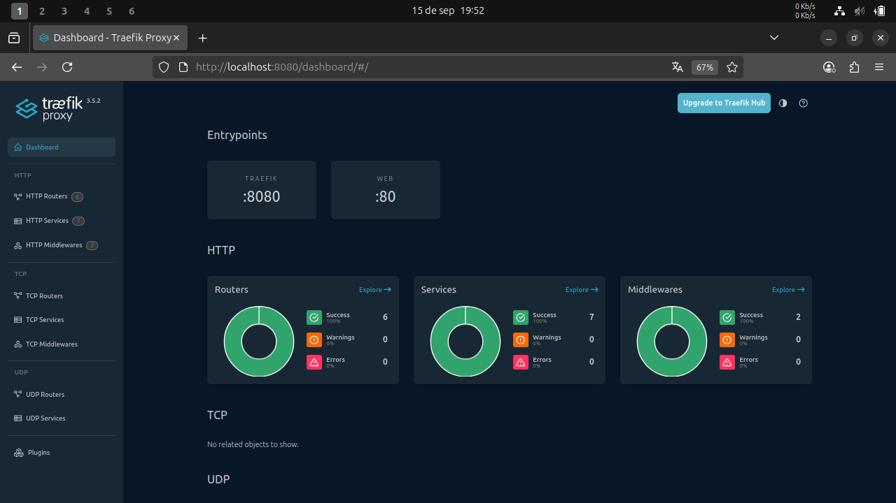
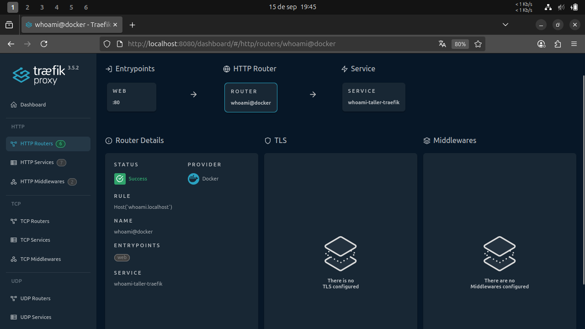

# Taller Traefik 

## Participantes

Walter Mauricio Alfonso Martinez - 202220718

Fabian Leonardo Correa Rojas - 202220087

## Preguntas

### ¿Qué ventaja aporta enrutar por host (dominio) vs por puerto?

Enrutar por host, permite alojar varios servicios bajo un mismo puerto, diferenciándose por su nombre de dominio, quitando el hecho de tener que exponer un puerto por cada servicio, como sucede en el enrutamiento por puerto.

### ¿Qué diferencia hay entre labels en los servicios y usar archivos de configuración?

Los labels se escriben directamente en el docker-compose, permitiendo una configuración rápida de los servicios, en cambio haciendo uso de archivos de configuración se necesita mantener reglas muy detalladas.

### ¿Cómo se entera Traefik de que había servicios nuevos?

Traefik hace uso del socker de Docker para detectar cualquier evento que se genere cuando se hace un `docker run` o `docker-compose up`. Igualmente, sucede en el caso que se detengan los servicios.

## Actividad

### Paso 1. Verificar requisitos

### Paso 2. Levantar Traefik

### Paso 3. Acceder al dashboard de Traefik

### Paso 4. Desplegar la aplicación de ejemplo

### Paso 5. Probar acceso a la aplicación

### Paso 6. Revisar routers en el dashboard

